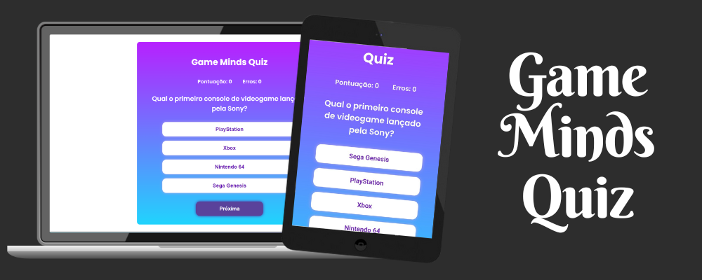

# Game Minds Quiz

## Descrição
Game Minds Quiz é um jogo estilo quiz sobre jogos de videogames. Este projeto consiste em um quiz interativo onde os jogadores respondem a uma série de perguntas relacionadas a jogos. Cada pergunta apresenta quatro alternativas e os jogadores ganham pontos quando respondem corretamente.

O jogo possui uma versão otimizada para dispositivos móveis, garantindo uma experiência de jogo agradável em diferentes tipos de dispositivos.

## Funcionalidades

- **10 Perguntas:** O quiz consiste em 10 perguntas relacionadas a jogos.
- **Pontuação:** Os jogadores ganham 1 ponto por cada resposta correta e perdem 1 ponto por cada resposta incorreta.
- **Resultado Final:** Após responder todas as perguntas, o jogo exibe o resultado final, mostrando quantas perguntas o jogador acertou e quantas errou.

## Tecnologias Utilizadas

- HTML
- CSS
- JavaScript

## Como Jogar

1. **Acessando o Jogo:**
   - Você pode acessar o jogo online [aqui](https://eduardodebarba.github.io/GameMindsQuiz/).
   - Para jogar localmente, basta clonar este repositório e abrir o arquivo `index.html` em seu navegador web.

2. **Responder às Perguntas:**
   - Para cada pergunta, escolha a alternativa que você acredita ser correta clicando sobre ela.

3. **Verificar Resultado:**
   - Após responder todas as perguntas, o jogo exibirá seu resultado final, indicando quantas perguntas você acertou e quantas errou.

## Contribuindo

Contribuições são bem-vindas! Se você quiser contribuir com melhorias neste jogo, siga estas etapas:

1. Fork o projeto
2. Crie sua branch de feature (`git checkout -b feature/MinhaFeature`)
3. Faça commit das suas mudanças (`git commit -am 'Adicionar nova funcionalidade'`)
4. Faça push para a branch (`git push origin feature/MinhaFeature`)
5. Abra um Pull Request

## Autor

Eduardo Debarba Scheuermann

## Licença

Este projeto é licenciado sob a Licença MIT.

